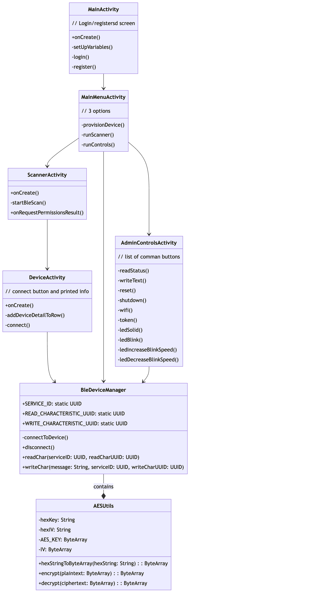

# SafePiConnect
This is the android application for the ***SafePi*** project. This application communicates with the SafPi device over Bluetooth Low Energy (BLE) as well as with ***SafePiWeb***. It's main functionality is to register new users, and provision new ***SafePi*** devices, but it also implements a BLE Scanner for connecting and viewing other devices in the users proximity. 

---
## Features:
SafePiConnet comes fully stocked with login and device provisioning capabilities, an advanced BLE scanner for scanning and connecting to devices, and a packet sniffer for analyzing BLE traffic for the SafePi device. It also includes a status window for remotely monitoring connected devices and their lock statuses. 

## Figures:
SafePiConnect Class Diagram

TODO: 
- Consolidate code into more reusable structures.
- Store user data and tokens in Android Keystore, as is being done with the Private key that is scanned in via the QR code.
- Store Data persistently. Not sure how the keystore works, but it would be great to store the credentials in a way that is persistent and just load those values when the app is turned on.
- There are several write requests made when provisioning. It doesn't break the system or anything, but it does appear to make things slower. Track this bug down.
- Creade a real menu that will that will allow for better navigation through the system. Likely a top menu. Also, make sure that the login is still required before hand. 
- Implement controls controls menu. This can easily be done by copy/paste the write to char code, and then following the commands defined in the SafePi-embedded repo.
- Expand the scanner with more device information, and the ability to connect. (Just for fun)
- Scanner works okay until you are in a busy area, in which case it overloads the view. It's not the scanner itself, as this is used several times throughout the app, it is the actual view. Suggestions were to implement a "Spinner" but that was a bit complicated and not necessary for our functionality. 
